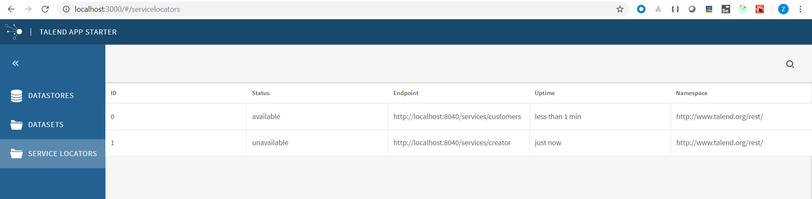

In this lesson, we would create a simple module named service locator. Just replace the src folder you could get the result.  


# Process details
## Prepare data
We would use data in src/assets/servicelocators.json.

## Add a module

We would set route, view and action configurations in src/assets/settings.json, also register the action in configure.js.


### 1. Add module in src/settings/HomeListView.json.
Add action configuration in src/assets/settings.json.
Action means the user event, like click, drag and so on.

```
    "HomeListView#servicelocators": {
      "saga": "handleServiceLocators",
      "sidepanel": {},
      "list": {
        "id": "servicelocator-list",
        "collectionId": "servicelocators",
        "list": {
          "columns": [
            { "key": "id", "label": "ID" },
            { "key": "status", "label": "Status" },
            { "key": "endpoint", "label": "Endpoint" },
            { "key": "uptime", "label": "Uptime" },
            { "key": "namespace", "label": "Namespace" }
          ]
        },
        "toolbar": {
          "filter": {
            "placeholder": "Find a ServiceLocator"
          },
          "sort": {
            "options": [
              { "id": "label", "name": "Name" },
              { "key": "status", "label": "Status" },
              { "id": "namespace", "name": "Namespace" }
            ]
          }
        },
        "initialState": {
          "sortOn": "label"
        }
      }
    }
```

### 2. Add router in src/settings/router.json

```
      {
        "path": "servicelocators",
        "component": "HomeListView",
        "componentId": "servicelocators"
      }
```	
	
### 3. Add menu in src/settings/SidePanel.json	

```
    "menu:servicelocators": {
      "id": "menu:servicelocators",
      "label": "Service Locators",
      "icon": "talend-folder",
      "payload": {
        "type": "MENU_LINK",
        "cmf": {
          "routerReplace": "/servicelocators"
        }
      }
    }
```

```
	"actionIds": ["menu:datastores", "menu:datasets","menu:servicelocator"]
```	

### 4. Add data handler in src/app/sagas.js	
We create handleServiceLocators.js to handle data.

```
import cmf from '@talend/react-cmf';
import { call, put } from 'redux-saga/effects';
import { ERROR_GETTING_SERVICELOCATORS } from '../constants';

export default function* handleServiceLocators() {
    const { response, data } = yield call(cmf.sagas.http.get, '/servicelocators.json');
    if (!response.ok) {
        yield put({
            type: ERROR_GETTING_SERVICELOCATORS,
            data,
        });
    } else {
        yield put(cmf.actions.collections.addOrReplace('servicelocators', data));
    }
}
```
		