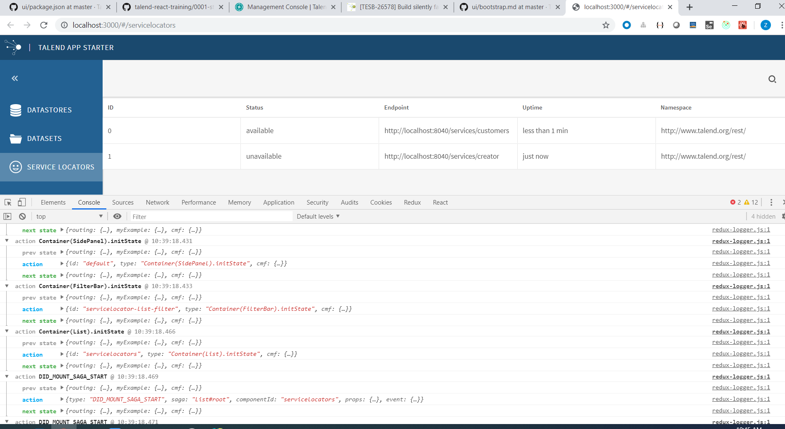

redux-logger

This step we will add redux-logger for action trace.  
With this middleware, we can get the previous state, current action, next state in web browser console. It helps a lot.



please see [redux middlewares acknowledge](https://redux.js.org/advanced/middleware) and [basic introduction for redux-logger](https://www.npmjs.com/package/redux-logger).

Redux middlewares will change process from `action -> reducer` to be `action -> middlewares -> reducer`.

```
import { createStore, applyMiddleware } from 'redux';
let store = createStore(
  reducers,
  initialState,
  applyMiddleware(A, B, C)
)
```

Then if a action is dispatched, then the trigger process will be `A(action) -> B(action) -> C(action) -> store.dispatch(action)`, but the execute process will be `C(action) -> B(action) -> A(action)`.

By reading the [cmf bootstrap.md](https://github.com/Talend/ui/blob/master/packages/cmf/src/bootstrap.md), we get to know how to add middle wares.

We add redux-logger in src/app/index.js.
```
import logger from 'redux-logger';

cmf.bootstrap({
	actionCreators,
	components,
	expressions,
	reducer,
	saga,
	sagas,
	settingsURL: '/settings.json',
	AppLoader: 'AppLoader',
	modules: [router.cmfModule],
	RootComponent: router.RootComponent,
	middlewares: [logger],
});
```

Note. make sure you have add dependency in package.json.
```
"redux-logger": "3.0.6",
```
