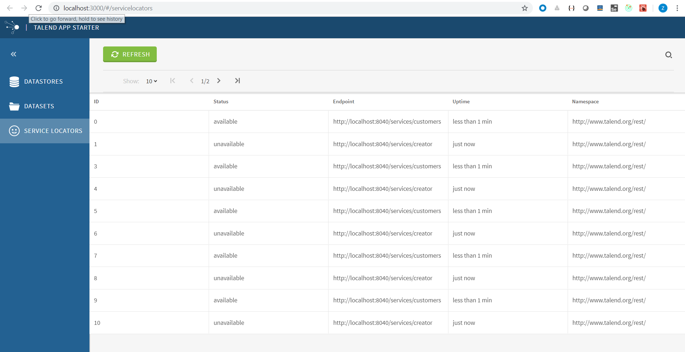

This step we will improve the service locator module.  



# Improve view

We will add a refresh button and pagination in the toolbar.

## Add `refresh` button in toolbar
HomeListView uses [List container](https://github.com/Talend/ui/blob/master/packages/containers/src/List/List.container.js), according to the [List example](https://github.com/Talend/ui/blob/master/packages/containers/examples/ExampleList.js),

#### Define a action type for it in app/constants/index.js.
```
export const REFRESH_SERVICE_LOCATORS = 'REFRESH_SERVICE_LOCATORS';
```

#### Add settings/actions.json and set configuration for this button.
```
{
  "actions":{
    "servicelocator:refresh": {
      "label": "Refresh",
      "bsStyle": "primary",
      "icon": "talend-refresh",
      "payload": {
        "type": "REFRESH_SERVICE_LOCATORS"
      }
    }
  }
}
```

#### Add saga for the refresh function in app/sagas/handleServiceLocators.js
```
export function* refreshServiceLocators() {
    yield call(handleServiceLocators);
}
```

#### Call this handleServiceLocators in app/saga.js
```
yield takeLatest(REFRESH_SERVICE_LOCATORS, refreshServiceLocators);
```

P.S. We use icon talend-refresh for refresh button. Please see all talend icons in http://talend.surge.sh/icons/.

#### Put refresh button in ServiceLocator view. Add in settings/HomeListView.json.
```
 "actions":{
    "left": ["servicelocator:refresh"]
 },
```

## Add pagination in toolbar  
To add pagination for a list, we just need to add `"pagination": {}` in toolbar configuration of HomeListView.json .

It will use default configurations in [Pagination component](https://github.com/Talend/ui/blob/master/packages/components/src/List/Toolbar/Pagination/Pagination.component.js).

```
Pagination.defaultProps = {
	itemsPerPage: 5,
	startIndex: 1,
	itemsPerPageOptions: [5, 10, 20, 50],
};
```

- We can access [talend common components online samples](http://talend.surge.sh/components), and also [talend form online sample](http://talend.surge.sh/forms).
- [Talend ui repository](https://github.com/Talend/ui) contains common components, cmf, form and so on.