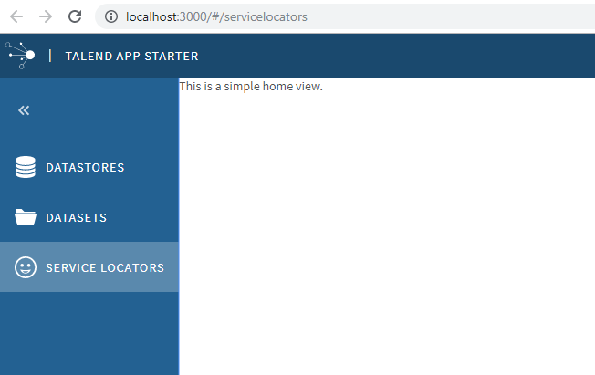

This step we will create a customized service locator module.
See  

The general idea is we replace the default HomeListView by a customized view SimpleHomeView. In this view, we could use our own module.