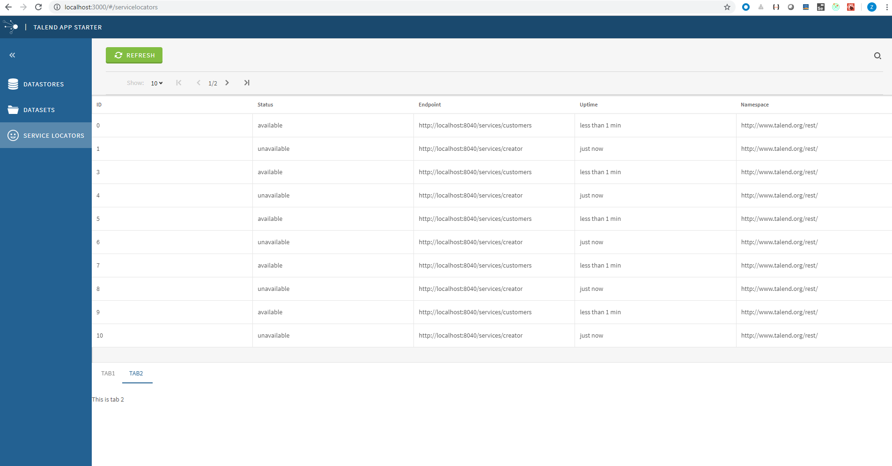

This step we will create a complex customized service locator module.
See  


We will try to use state, dispatch in cmf.

# 1. Create CustomizedHomeView
## list  

 We copy code from [HomeListView](https://github.com/Talend/ui/blob/master/packages/containers/src/HomeListView/HomeListView.component.js) to inject the list.

## tab
 We will add a tab in the bottom of this view.
 ```
 <TabBar {...tabProps} selectedKey={selectedKey} onSelect={onSelectTab}> This is tab {selectedKey} </TabBar>
 ```

### selectedKey
selectedKey is from the state.
```
const mapStateToProps = ({ serviceLocator }) => ({
    selectedKey: serviceLocator.selectedKey,
});
```
src/app/reducers/serviceLocator.js give the initial value to selecteKey, and also define the related reducer.

### onSelect
An action is dispatched on calling onSelect.
```
const mapDispatchToProps = dispatch => ({
    onSelectTab: (event, item) => dispatch(actionCreators.selectTab(item.key)),
});
```
src/app/actions/serviceLocator.js give the actionCreators.  
src/app/saga/index.js shows which handler is mapped to this action.  
src/app/sagas/handlerServiceLocators.js show how to set related state.
src/app/index.js shows all related parameters of cmfConnect.

# 2. update settings
##  router.json
```
{
    "path": "servicelocators",
    "component": "CustomizedHomeListView",
    "componentId": "servicelocators"
}
 ```

## HomeListView.json
```
    "CustomizedHomeListView#servicelocators": {
```
CustomizedHomeListView is the displayName of CustomizedHomeView.

After compile, there will be dist/settings.json, and its content is from src/settings/*.json.
